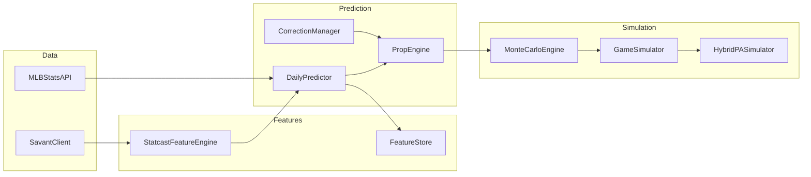
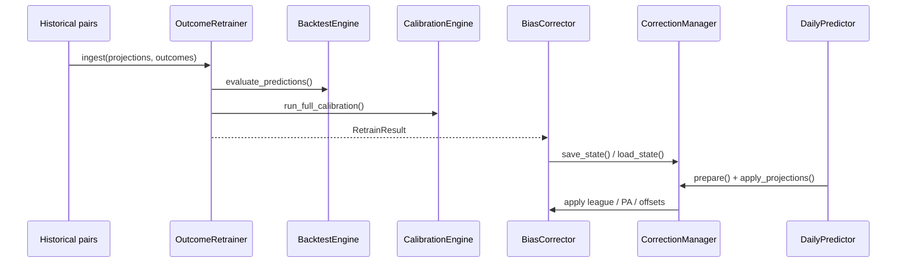

# Baseball Predictor — Architecture

Layered MLB daily prediction system optimized for accuracy, modularity, backtestability, and self-improvement. Each layer has a single responsibility and communicates through shared domain types in `src/models/dataclasses.py`.

> **Quick start:** See [README.md](README.md) for installation, CLI/GUI usage, and a project overview.  
> **Folder layout:** See [STRUCTURE.md](STRUCTURE.md) for production vs scripts vs legacy organization.

## Layer Overview

```
Data → Features → Simulation → Prediction → Evaluation → Learning
                              ↑                    │
                              └──── Corrections ───┘
```

| Layer | Package | Responsibility |
|-------|---------|----------------|
| **Models** | `src/models/` | Shared dataclasses and enums (`LeagueBaselines`, `PropProjection`, etc.) |
| **Data** | `src/data/` | Fetch schedule, lineups, stats (MLB API) and Statcast metrics (Savant) |
| **Features** | `src/features/` | Build `StatcastProfile` objects and persist daily feature bundles |
| **Simulation** | `src/simulation/` | PA-level and game-level Monte Carlo simulation |
| **Prediction** | `src/prediction/` | Daily orchestration, prop projections, optional corrections, +EV edge |
| **Evaluation** | `src/evaluation/` | Backtest metrics and calibration parameter fitting |
| **Learning** | `src/learning/` | Outcome retraining and bias correction application |
| **Config** | `config/config.json` | League averages, park factors, simulation counts, learning settings |
| **Utils** | `src/utils/` | Logging and TTL caching |

## Data Flow (Daily Prediction)



1. **DailyPredictor** loads config and constructs injectable dependencies.
2. **MLBStatsAPI** returns confirmed hitters/pitchers for a slate date.
3. **StatcastFeatureEngine** builds `StatcastProfile` per hitter (pybaseball or local Savant CSV).
4. Profiles are wrapped in **PlayerFeatureBundle** with park, matchup, and opposing pitcher context.
5. **PropEngine** runs **MonteCarloEngine** simulations for hitter props or rate-based K/9 regression for pitchers.
6. **CorrectionManager** optionally adjusts league/PA parameters before simulation and projection offsets after.

## Key Classes

### Models (`src/models/dataclasses.py`)

| Type | Purpose |
|------|---------|
| `LeagueBaselines` | League-average rates; loaded from `config.json` via `from_config()` |
| `StatcastProfile` | Hitter Statcast metrics with sample size and fallback flags |
| `PlayerFeatureBundle` | Hitter + statcast + park + matchup + expected PA |
| `PropProjection` | Single prop output (mean, confidence, optional `MonteCarloResult`) |
| `DailyPrediction` | Full slate result: hitter projections, pitcher projections, value plays |

### Data

| Class | File | Purpose |
|-------|------|---------|
| `MLBStatsAPI` | `mlb_api.py` | Schedule, lineups, hitting/pitching stats; day-level TTL cache |
| `SavantClient` | `savant.py` | Statcast fetch (pybaseball) or CSV import; league fallbacks |
| `OddsProvider` | `data/odds/base.py` | Abstract interface for all odds sources |
| `FileOddsProvider` | `data/odds/file_provider.py` | Date-aware CSV/JSON loading |
| `OddsAPIProvider` | `data/odds/odds_api_provider.py` | The Odds API live player props |
| `CompositeOddsProvider` | `data/odds/composite.py` | Merges sources (`OddsLoader` alias) |
| `WeatherClient` | `data/weather_client.py` | Game-day weather from MLB feed |
| `UmpireClient` | `data/umpire_client.py` | Home-plate umpire and K/run biases |
| `InjuryClient` | `data/injury_client.py` | Active/IL roster status |
| `StatcastDistributionBuilder` | `data/statcast_distributions.py` | Launch angle / exit velo distributions |

### Features

| Class | File | Purpose |
|-------|------|---------|
| `StatcastFeatureEngine` | `legacy_statcast_features.py` | Batch `StatcastProfile` building (production path) |
| `StatcastFeatureEngineer` | `ml/statcast_features.py` | Modular ML feature layer (future integration) |
| `RichFeatureEnricher` | `rich_feature_enricher.py` | Bridge to `src/features/ml/` pipeline |
| `FeatureFactory` | `feature_factory.py` | Daily bundle orchestration |
| `LineupIntelligence` | `lineup_intelligence.py` | Lineup certainty scoring; PA/confidence/sim adjustments |
| `FeatureStore` | `feature_store.py` | Persist bundles as JSON/Parquet for backtests |

### Simulation

| Class | File | Purpose |
|-------|------|---------|
| `PASimulatorConfig` | `pa_simulator.py` | Calibratable logit coefficients for PA outcomes |
| `HybridPASimulator` | `pa_simulator.py` | Single PA outcome model (K, BB, BIP, HR, hit type) |
| `BaseState` | `base_state.py` | Runner advancement and scoring logic |
| `GameSimulator` | `game_simulator.py` | Full game stat accumulation from repeated PAs |
| `MonteCarloEngine` | `monte_carlo.py` | N-run distribution for hits, HRR, HR, fantasy |

### Prediction

| Class | File | Purpose |
|-------|------|---------|
| `DailyPredictor` | `daily_predictor.py` | End-to-end orchestrator; all dependencies injectable |
| `PropEngine` | `prop_engine.py` | Converts bundles to `PropProjection`; owns simulation stack |
| `CorrectionManager` | `correction_manager.py` | Optional bridge to learning layer (off by default) |
| `EdgeCalculator` | `edge_calculator.py` | +EV edge vs odds lines; integrated into `DailyPredictor.predict()` |

### Evaluation

| Class | File | Purpose |
|-------|------|---------|
| `BacktestEngine` | `backtest_engine.py` | Match projections to outcomes; per-category MAE/RMSE |
| `CalibrationEngine` | `calibration.py` | Fit league baselines, PA intercepts, category biases |
| `PipelineValidator` | `pipeline_validator.py` | End-to-end validation on historical dates or pairs CSV |
| `ParkFactorEstimator` | `park_factor_estimator.py` | Empirical venue HR/hit/run factors from pairs |
| `SlotPAEstimator` | `slot_pa_estimator.py` | Batting-order PA multipliers (replaces lineup_slot_runs_rbi) |
| `WalkForwardValidator` | `walk_forward_validator.py` | Rolling walk-forward backtests |
| `ChampionChallengerTester` | `champion_challenger.py` | Promote changes only when validated |
| `CalibrationTracker` | `calibration_tracker.py` | Brier score and reliability bins |
| `ROISimulator` | `roi_simulator.py` | Flat-stake +EV ROI with vig |

### Learning

| Class | File | Purpose |
|-------|------|---------|
| `OutcomeRetrainer` | `outcome_retrainer.py` | Ingest prediction-outcome pairs; `fit()` → `RetrainResult` |
| `BiasCorrector` | `bias_corrector.py` | Apply learned offsets to projections, league, and PA config |
| `RetrainRunner` | `retrain_runner.py` | Orchestrate `OutcomeRetrainer.fit()` and persist correction state |
| `PredictionArchive` | `prediction_archive.py` | Persist daily projections for outcome pairing |
| `OutcomeRecorder` | `outcome_recorder.py` | Fetch MLB actuals and append pairs CSV |

## Self-Improvement / Correction System

Corrections are **optional and off by default**. They do not run automatically on every prediction.



### Closing the data loop

```bash
# 1. Predict (with outcome_recording.enabled — archives to data/learning/predictions/)
python run_daily.py --date 2026-07-01 --category hrr

# 2. After games finalize — pair predictions with MLB boxscore actuals
python run_record_outcomes.py --date 2026-07-01

# 3. Retrain corrections from accumulated pairs
python run_retrain.py

# 4. Validate pipeline quality
python run_validate.py --from-pairs
```

### Training corrections

**CLI (recommended):**

```bash
python run_retrain.py --pairs data/learning/prediction_outcomes.csv
python run_retrain.py --dry-run   # preview fit without saving
```

**Programmatic:**

```python
from src.learning import RetrainRunner

runner = RetrainRunner.from_config(config)
report = runner.run()
# State saved to retraining.output_state_path (default: data/learning/bias_corrections.json)
```

### Applying corrections at prediction time

**Option A — CLI flag:**

```bash
python run_daily.py --date 2026-07-01 --category hrr --apply-corrections
```

**Option B — Config default:**

```json
"learning": {
  "apply_corrections": true,
  "correction_state_path": "data/learning/bias_corrections.json"
}
```

**Option C — Programmatic:**

```python
predictor = DailyPredictor()
predictor.enable_corrections()  # loads state file if present
result = predictor.predict("2026-07-01", apply_corrections=True)
```

### What gets corrected

| Stage | When | What changes |
|-------|------|--------------|
| Model parameters | Before simulation (`CorrectionManager.prepare()`) | `LeagueBaselines`, `PASimulatorConfig` via `PropEngine.configure_simulation()` |
| Output offsets | After simulation (`apply_projections()`) | Per-category bias added to `projected_value`, scaled by confidence |

Correction settings in `config.json`:

```json
"learning": {
  "apply_corrections": false,
  "correction_state_path": "data/learning/bias_corrections.json",
  "apply_model_parameters": true,
  "apply_projection_offsets": true
}
```

Calibration shrinkage (used during `fit()`) is in the `calibration` block and loaded via `CalibrationConfig.from_config()`.

## Running Predictions

### GUI

```bash
python main.py
```

Minimal Tkinter UI: date, category, corrections toggle, CSV export.

### CLI

```bash
python run_daily.py --date 2026-07-01 --category hrr --top 25
python run_daily.py --apply-corrections --format all -o data/predictions.csv
python run_daily.py --with-edges --odds-file data/odds/lines.csv
python run_daily.py --category strikeouts --pitchers-only
python run_daily.py --refresh                    # bypass MLB API day cache
python run_daily.py --verbose                    # debug logging

python run_retrain.py                            # fit corrections from config paths
```

### Programmatic (backtest-friendly)

```python
from src.prediction import DailyPredictor, PropEngine
from src.models.dataclasses import LeagueBaselines

league = LeagueBaselines.from_config({})
engine = PropEngine(league_baselines=league, n_sims=2000)
predictor = DailyPredictor(prop_engine=engine, mlb_api=mock_api)
result = predictor.predict("2026-07-01", hitter_categories=("hrr",))
```

Inject mocks for `mlb_api`, `statcast_engine`, or `prop_engine` to run without network access.

## Dependencies

| Package | Required | Purpose |
|---------|----------|---------|
| `requests`, `pandas`, `numpy`, `scipy` | Yes | API calls, data handling, calibration math |
| `pybaseball` | No | Live Statcast fetch via `SavantClient`; omit and use `data/savant/stats.csv` instead |
| `pytest` | No (dev) | `pip install -e ".[dev]"` |

## Configuration

Canonical config: `config/config.json`.

| Block | Used by |
|-------|---------|
| `season`, `league_avg` | `LeagueBaselines.from_config()` |
| `weights` | Pitcher season/recent K/9 blend |
| `pitcher_regression` | K/9 regression toward league |
| `park_factors` | `DailyPredictor._park_factors()` |
| `lineup_intelligence` | `LineupIntelligence` — certainty scores and adjustment tables |
| `lineup_slot_runs_rbi` | Slot-based expected PA factors (also used by lineup intelligence) |
| `savant.csv_path` | Optional local Savant CSV override |
| `simulation.n_sims` | Monte Carlo run count |
| `fantasy_scoring` | `FantasyScoring.from_config()` |
| `odds` | `OddsSettings` — sources (`file`, `odds_api`), merge precedence, min edge |
| `outcome_recording` | `OutcomeRecordingSettings` — archive path, pairs CSV, auto-archive |
| `edge` | `EdgeThresholds.from_config()` — classification thresholds and default spreads |
| `learning` | `CorrectionManager` / `CorrectionSettings` |
| `retraining` | `RetrainSettings` — pairs path, lookback, min pairs, output state |
| `calibration` | `CalibrationConfig.from_config()` |

## Package Exports

Each layer exposes a minimal public API via `__init__.py`:

- `src.models` — domain dataclasses
- `src.data` — `MLBStatsAPI`, `SavantClient`, `CompositeOddsProvider` (`OddsLoader` alias)
- `src.features` — `StatcastFeatureEngine`, `LineupIntelligence`, `FeatureStore`
- `src.simulation` — `HybridPASimulator`, `MonteCarloEngine`, `PASimulatorConfig`
- `src.prediction` — `DailyPredictor`, `PropEngine`, `CorrectionManager`, `EdgeCalculator`
- `src.evaluation` — `BacktestEngine`, `CalibrationEngine`, `PipelineValidator`
- `src.learning` — `OutcomeRetrainer`, `BiasCorrector`, `RetrainRunner`, `PredictionArchive`, `OutcomeRecorder`

## Tests

```bash
python -m pytest tests/ -v
```

- `tests/test_simulation.py` — PA simulator, game sim, Monte Carlo
- `tests/test_correction_manager.py` — correction integration
- `tests/test_daily_predictor.py` — full prediction flow with mocks, edges, corrections
- `tests/test_odds_loader.py` — file and composite odds providers
- `tests/test_outcome_recorder.py` — MLB actuals pairing
- `tests/test_pipeline_validator.py` — end-to-end validation
- `tests/test_self_improvement_loop.py` — archive → record → retrain flow
- `tests/test_retrain_runner.py` — retrain pipeline
- `tests/test_backtest_calibration.py` — backtest and calibration
- `tests/test_run_daily_cli.py` — CLI argument parsing

## Legacy Code

Pre-architecture modules were removed during the final cleanup. See `legacy/README.md` for the migration map. Removed code can be recovered from git history.

## Known Gaps (Future Phases)

These are intentional deferrals, not cleanup oversights:

- **HRR/fantasy Odds API markets** not mapped (file odds required for those categories)
- **Weather, BvP, injuries** data modules not yet built
- **Pitcher feature pipeline** not yet built (strikeouts use MLB rate regression)
- **Scheduled/cron retraining** not built; use `run_retrain.py` manually or wire to your scheduler
- **Full GUI** deferred; root `gui.py` is a minimal shell over `DailyPredictor`